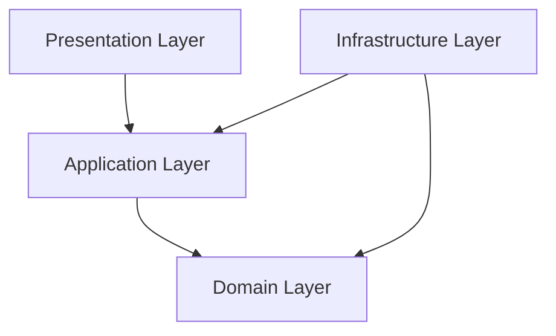
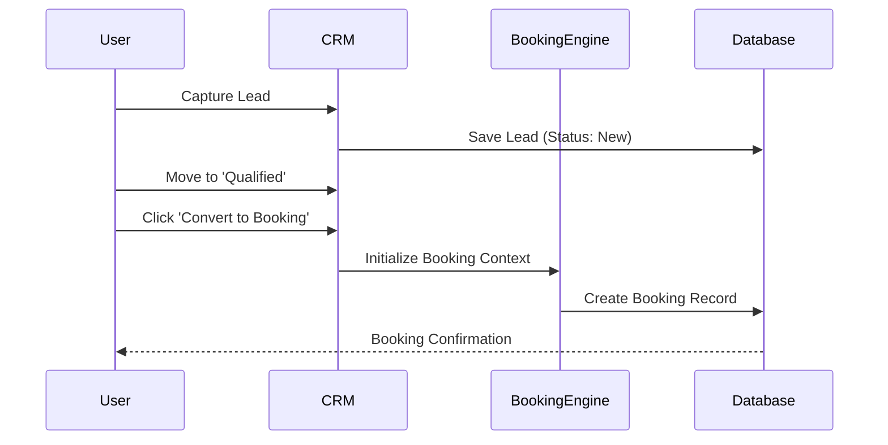

# 🚀 Advanced Travel Management System (TMS) - Features Overview

Welcome to the feature documentation for our enterprise-grade **Travel Management System**. Built with a focus on scalability, maintainability, and user experience, this platform integrates core travel business operations into a unified digital workspace.

---

## 🏗️ 1. Professional Architecture

The system is engineered using **Domain-Driven Design (DDD)** and **Clean Architecture** principles, ensuring that the business logic remains isolated from infrastructure concerns.

### Technical Stack
- **Frontend**: React 18, TypeScript, Tailwind CSS, Lucide Icons, Recharts.
- **Backend**: Node.js, Express, TypeScript, MongoDB (via Mongoose).
- **Communication**: RESTful API with standardized JSON responses.

### Server-Side Layering

---

## 💼 2. Travel-Specific CRM

Our CRM is not just a generic lead tracker; it's optimized for the travel industry's high-touch conversion cycles.

### Key Capabilities
- **Lead Lifecycle Management**: Multi-stage pipeline board (Lead → Inquiry → Quote → Booked).
- **Automated Conversions**: Convert qualified leads directly into active bookings with a single click.
- **Dynamic Lead Capture**: Customizable forms for gathering passenger information, destination preferences, and budget.
- **Visual Pipeline**: Drag-and-drop Kanban board for real-time sales team orchestration.

### Lead-to-Booking Flow

---

## 📅 3. Unified Booking Engine

A robust engine designed to handle complex travel inventories and multi-channel booking requirements.

- **Inventory Control**: Real-time management of travel resources (Hotels, Tours, Transportation).
- **Smart Validation**: Conflict detection and availability checking during the booking process.
- **Pricing Logic**: Support for tiered pricing, seasonality, and custom markups.
- **Seamless Integration**: Hooks directly into the CRM and Financial modules.

---

## 📊 4. Dynamic Dashboard Builder

Empower administrators with real-time data visualization and customizable business tracking.

- **Drag-and-Drop Canvas**: Users can build layouts by dragging widgets onto a grid.
- **Widget Library**:
    - **KPI Cards**: Real-time counters for Total Revenue, Active Bookings, and Lead Conversion Rates.
    - **Interactive Charts**: Area charts, Radar charts, and Line graphs powered by Recharts.
    - **Utility Widgets**: Custom text blocks, dividers, and data tables.
- **Data-Driven**: Widgets fetch real-time data from backend endpoints with loading and error state management.

---

## 🛡️ 5. Quality & Security

- **Type Safety**: End-to-end TypeScript integration minimizes runtime errors.
- **Modular Design**: Individual modules (CRM, Dashboard, Booking) can be updated or replaced without breaking the system.
- **Standardized Response Patterns**: Consistent API error handling and status codes.
- **Scalable Infrastructure**: Designed to be deployed with containerization (Docker) and managed cloud services.

---

---

> [!TIP]
> This project follows the philosophy of "Code as Documentation." Explore the `server/src/domain` directory to understand the core business rules that drive these features.
