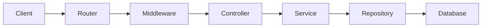
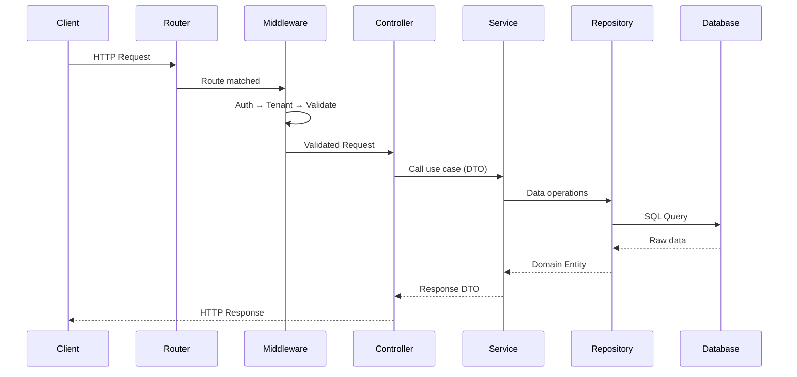
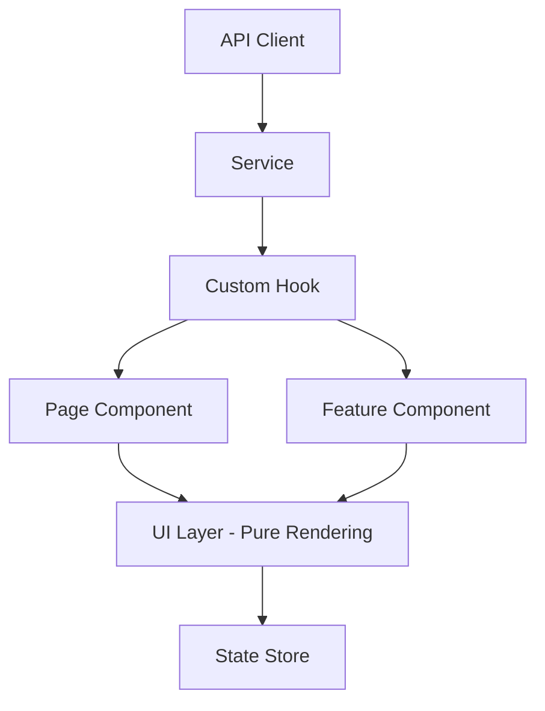
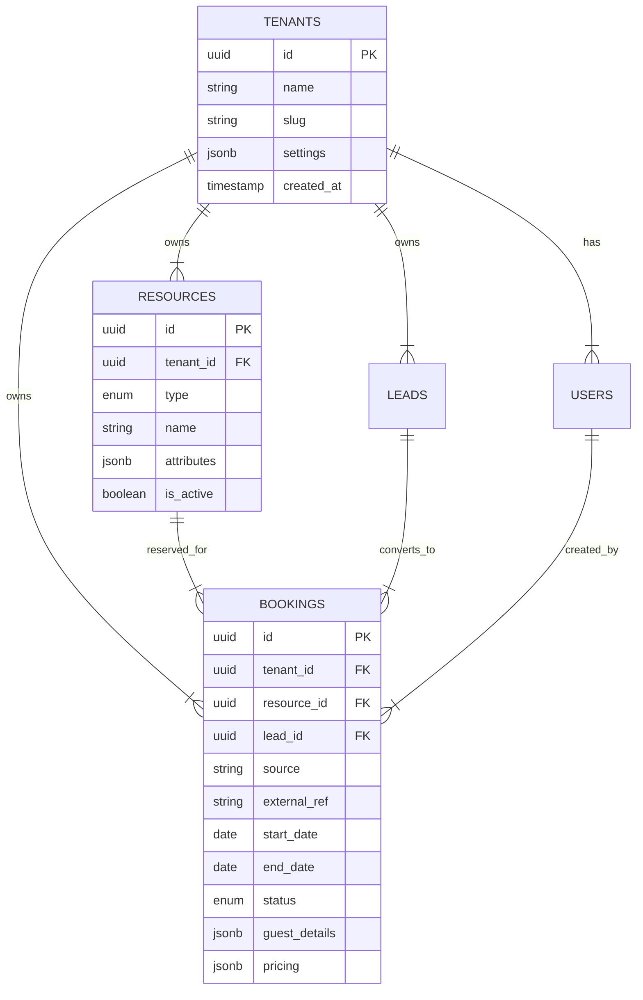
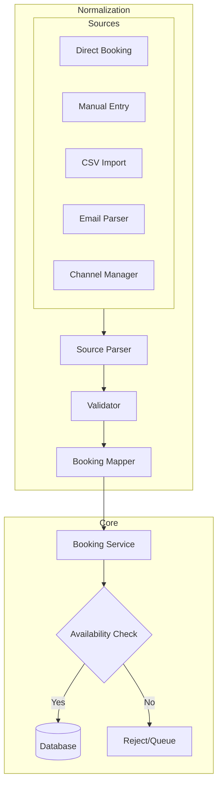

# Travel Operations Platform - Architecture Design

**THE OPERATING SYSTEM FOR TRAVEL BUSINESSES**

A B2B multi-tenant SaaS replacing CRMs, PMS, and operational spreadsheets for hotels, tour operators, trek organizers, and adventure providers.

## 1. System Architecture Overview

*   **Infrastructure Layer**: PostgreSQL, Redis Cache, Job Queue
*   **Domain Layer**: Domain Entities, Value Objects, Domain Events, Repositories
*   **Application Layer**: Application Services, Domain Services, Use Cases
*   **API Gateway**: Express Router, Auth/Tenant/Validation Middleware, Controllers
*   **Client Layer**: React UI Components, Custom Hooks, Frontend Services, API Client

## 2. Core Design Principles

### 2.1 Clean Architecture Layers

| Layer | Responsibility | Dependencies |
| :--- | :--- | :--- |
| **Domain** | Business entities, rules, value objects | None (innermost) |
| **Application** | Use cases, orchestration, DTOs | Domain |
| **Infrastructure** | DB, external services, frameworks | Application, Domain |
| **Presentation** | Controllers, API routes | Application |

### 2.2 Non-Negotiable Rules

> [!CAUTION]
> **Hard Limits Enforced Throughout Codebase**
>
> *   ❌ No file exceeds 150 lines
> *   ❌ No business logic in controllers
> *   ❌ No database logic outside repositories
> *   ❌ No data fetching in UI components
> *   ❌ No OTA-specific hardcoding

## 3. Backend Architecture

### 3.1 Directory Structure

```typescript
server/
├── src/
│   ├── app.ts                     # Express app setup
│   ├── server.ts                  # Server entry point
│   │
│   ├── config/                    # Configuration
│   │   ├── database.ts
│   │   ├── environment.ts
│   │   └── index.ts
│   │
│   ├── domain/                    # Domain Layer (Pure)
│   │   ├── entities/
│   │   │   ├── Resource.ts
│   │   │   ├── Booking.ts
│   │   │   ├── Lead.ts
│   │   │   ├── User.ts
│   │   │   └── Tenant.ts
│   │   ├── value-objects/
│   │   │   ├── Money.ts
│   │   │   ├── DateRange.ts
│   │   │   ├── ResourceType.ts
│   │   │   └── BookingStatus.ts
│   │   ├── events/
│   │   │   ├── BookingCreated.ts
│   │   │   └── ResourceUpdated.ts
│   │   └── interfaces/
│   │       ├── IResourceRepository.ts
│   │       └── IBookingRepository.ts
│   │
│   ├── application/               # Application Layer
│   │   ├── services/
│   │   │   ├── BookingService.ts
│   │   │   ├── ResourceService.ts
│   │   │   ├── AvailabilityService.ts
│   │   │   └── LeadService.ts
│   │   ├── dtos/
│   │   │   ├── CreateBookingDTO.ts
│   │   │   ├── ResourceDTO.ts
│   │   │   └── BookingResponseDTO.ts
│   │   └── mappers/
│   │       ├── BookingMapper.ts
│   │       └── ResourceMapper.ts
│   │
│   ├── infrastructure/            # Infrastructure Layer
│   │   ├── database/
│   │   │   ├── connection.ts
│   │   │   ├── migrations/
│   │   │   └── seeds/
│   │   ├── repositories/
│   │   │   ├── ResourceRepository.ts
│   │   │   ├── BookingRepository.ts
│   │   │   └── TenantRepository.ts
│   │   ├── cache/
│   │   │   └── RedisCache.ts
│   │   └── external/
│   │       └── EmailService.ts
│   │
│   ├── presentation/              # Presentation Layer
│   │   ├── controllers/
│   │   │   ├── BookingController.ts
│   │   │   ├── ResourceController.ts
│   │   │   └── LeadController.ts
│   │   ├── routes/
│   │   │   ├── index.ts
│   │   │   ├── booking.routes.ts
│   │   │   └── resource.routes.ts
│   │   ├── middleware/
│   │   │   ├── auth.middleware.ts
│   │   │   ├── tenant.middleware.ts
│   │   │   ├── validation.middleware.ts
│   │   │   └── error.middleware.ts
│   │   └── validators/
│   │       ├── booking.validator.ts
│   │       └── resource.validator.ts
│   │
│   ├── shared/                    # Shared Utilities
│   │   ├── errors/
│   │   │   ├── AppError.ts
│   │   │   ├── NotFoundError.ts
│   │   │   └── ValidationError.ts
│   │   ├── types/
│   │   │   ├── RequestContext.ts
│   │   │   └── Pagination.ts
│   │   └── utils/
│   │       ├── dateUtils.ts
│   │       └── idGenerator.ts
│   │
│   └── types/                     # TypeScript Declarations
│       └── express.d.ts
│
├── tests/
├── package.json
├── tsconfig.json
└── .env.example
```

### 3.2 Data Flow Pattern



#### Detailed Request Lifecycle



### 3.3 Controller Pattern (Thin Controller)

```typescript
// presentation/controllers/BookingController.ts
// ❌ NO business logic here - only request/response handling
export class BookingController {
  constructor(private bookingService: BookingService) {}
  async create(req: Request, res: Response, next: NextFunction): Promise<void> {
    try {
      const dto = req.body as CreateBookingDTO;
      const result = await this.bookingService.createBooking(dto, req.context);
      res.status(201).json(result);
    } catch (error) {
      next(error);
    }
  }
}
```

### 3.4 Service Pattern (Business Logic Home)

```typescript
// application/services/BookingService.ts
// ✅ ALL business logic lives here
export class BookingService {
  constructor(
    private bookingRepo: IBookingRepository,
    private resourceRepo: IResourceRepository,
    private availabilityService: AvailabilityService
  ) {}
  async createBooking(dto: CreateBookingDTO, ctx: RequestContext): Promise<BookingResponseDTO> {
    // 1. Check availability
    const isAvailable = await this.availabilityService.check(
      dto.resourceId,
      dto.dateRange,
      ctx.tenantId
    );
    if (!isAvailable) throw new ConflictError('Resource not available');
    // 2. Create domain entity
    const booking = Booking.create({
      tenantId: ctx.tenantId,
      resourceId: dto.resourceId,
      ...dto
    });
    // 3. Persist
    const saved = await this.bookingRepo.save(booking);
    // 4. Return DTO
    return BookingMapper.toDTO(saved);
  }
}
```

### 3.5 Repository Pattern (Data Access Only)

```typescript
// infrastructure/repositories/BookingRepository.ts
// ❌ NO business logic - only data access
export class BookingRepository implements IBookingRepository {
  constructor(private db: Database) {}
  async save(booking: Booking): Promise<Booking> {
    const result = await this.db.query(
      `INSERT INTO bookings (id, tenant_id, resource_id, ...) 
       VALUES ($1, $2, $3, ...) RETURNING *`,
      [booking.id, booking.tenantId, booking.resourceId, ...]
    );
    return BookingMapper.toDomain(result.rows[0]);
  }
  async findByTenant(tenantId: string, pagination: Pagination): Promise<Booking[]> {
    const result = await this.db.query(
      `SELECT * FROM bookings WHERE tenant_id = $1 LIMIT $2 OFFSET $3`,
      [tenantId, pagination.limit, pagination.offset]
    );
    return result.rows.map(BookingMapper.toDomain);
  }
}
```

## 4. Frontend Architecture

### 4.1 Directory Structure

```typescript
client/
├── src/
│   ├── main.tsx                   # Entry point
│   ├── App.tsx                    # Root component
│   │
│   ├── api/                       # API Client Layer
│   │   ├── client.ts              # Axios instance + interceptors
│   │   ├── bookingApi.ts
│   │   ├── resourceApi.ts
│   │   └── types.ts
│   │
│   ├── services/                  # Business Logic Layer
│   │   ├── bookingService.ts
│   │   ├── resourceService.ts
│   │   └── availabilityService.ts
│   │
│   ├── hooks/                     # Data Hooks Layer
│   │   ├── useBookings.ts
│   │   ├── useResources.ts
│   │   ├── useAuth.ts
│   │   └── useTenant.ts
│   │
│   ├── components/                # UI Components (Pure)
│   │   ├── ui/                    # Shadcn base components
│   │   ├── layout/
│   │   │   ├── Sidebar.tsx
│   │   │   ├── Header.tsx
│   │   │   └── MainLayout.tsx
│   │   └── common/
│   │       ├── LoadingSpinner.tsx
│   │       └── ErrorBoundary.tsx
│   │
│   ├── features/                  # Feature Modules
│   │   ├── bookings/
│   │   │   ├── components/
│   │   │   ├── hooks/
│   │   │   └── index.ts
│   │   ├── resources/
│   │   ├── leads/
│   │   └── dashboard/
│   │
│   ├── pages/                     # Page Components
│   │   ├── Dashboard.tsx
│   │   ├── Bookings.tsx
│   │   ├── Resources.tsx
│   │   └── Settings.tsx
│   │
│   ├── store/                     # Global State (if needed)
│   │   ├── authStore.ts
│   │   └── tenantStore.ts
│   │
│   ├── types/                     # TypeScript Types
│   │   ├── booking.types.ts
│   │   ├── resource.types.ts
│   │   └── api.types.ts
│   │
│   ├── utils/                     # Pure Utilities
│   │   ├── formatters.ts
│   │   ├── validators.ts
│   │   └── dateUtils.ts
│   │
│   └── styles/
│       ├── globals.css
│       └── tailwind.config.ts
│
├── package.json
├── tsconfig.json
├── vite.config.ts
└── tailwind.config.js
```

### 4.2 Data Flow Pattern



### 4.3 Hook Pattern (Data Preparation)

```typescript
// hooks/useBookings.ts
// ✅ All data fetching and transformation here
export function useBookings(filters: BookingFilters) {
  const { data, isLoading, error } = useQuery({
    queryKey: ['bookings', filters],
    queryFn: () => bookingService.getBookings(filters),
  });
  // Transform data for UI consumption
  const formattedBookings = useMemo(() => 
    data?.map(booking => ({
      ...booking,
      displayDate: formatDateRange(booking.startDate, booking.endDate),
      statusColor: getStatusColor(booking.status),
    })),
    [data]
  );
  return { bookings: formattedBookings, isLoading, error };
}
```

### 4.4 Component Pattern (Pure UI)

```tsx
// features/bookings/components/BookingCard.tsx
// ❌ NO data fetching, NO complex conditions
interface BookingCardProps {
  booking: FormattedBooking;
  onEdit: (id: string) => void;
  onCancel: (id: string) => void;
}
export function BookingCard({ booking, onEdit, onCancel }: BookingCardProps) {
  return (
    <Card>
      <CardHeader>
        <CardTitle>{booking.guestName}</CardTitle>
        <Badge variant={booking.statusColor}>{booking.status}</Badge>
      </CardHeader>
      <CardContent>
        <p>{booking.displayDate}</p>
        <p>{booking.resourceName}</p>
      </CardContent>
      <CardFooter>
        <Button onClick={() => onEdit(booking.id)}>Edit</Button>
        <Button variant="destructive" onClick={() => onCancel(booking.id)}>
          Cancel
        </Button>
      </CardFooter>
    </Card>
  );
}
```

## 5. Database Schema (Multi-Tenant)

### 5.1 Schema Strategy: Row-Level Isolation

Every table includes `tenant_id` with enforced foreign key and RLS policies.



### 5.2 Core Tables

```sql
-- Tenants (Companies)
CREATE TABLE tenants (
    id UUID PRIMARY KEY DEFAULT gen_random_uuid(),
    name VARCHAR(255) NOT NULL,
    slug VARCHAR(100) UNIQUE NOT NULL,
    settings JSONB DEFAULT '{}',
    created_at TIMESTAMPTZ DEFAULT NOW(),
    updated_at TIMESTAMPTZ DEFAULT NOW()
);

-- Users
CREATE TABLE users (
    id UUID PRIMARY KEY DEFAULT gen_random_uuid(),
    tenant_id UUID NOT NULL REFERENCES tenants(id),
    email VARCHAR(255) NOT NULL,
    password_hash VARCHAR(255) NOT NULL,
    role VARCHAR(50) NOT NULL DEFAULT 'staff',
    profile JSONB DEFAULT '{}',
    is_active BOOLEAN DEFAULT true,
    created_at TIMESTAMPTZ DEFAULT NOW(),
    UNIQUE(tenant_id, email)
);

-- Resources (Unified)
CREATE TABLE resources (
    id UUID PRIMARY KEY DEFAULT gen_random_uuid(),
    tenant_id UUID NOT NULL REFERENCES tenants(id),
    type VARCHAR(50) NOT NULL, -- ROOM, TOUR, TREK, ACTIVITY, VEHICLE, EQUIPMENT
    name VARCHAR(255) NOT NULL,
    description TEXT,
    capacity INTEGER,
    base_price DECIMAL(12,2),
    currency VARCHAR(3) DEFAULT 'INR',
    attributes JSONB DEFAULT '{}',
    is_active BOOLEAN DEFAULT true,
    created_at TIMESTAMPTZ DEFAULT NOW(),
    updated_at TIMESTAMPTZ DEFAULT NOW()
);

-- Bookings (Unified)
CREATE TABLE bookings (
    id UUID PRIMARY KEY DEFAULT gen_random_uuid(),
    tenant_id UUID NOT NULL REFERENCES tenants(id),
    resource_id UUID NOT NULL REFERENCES resources(id),
    lead_id UUID REFERENCES leads(id),
    created_by UUID REFERENCES users(id),
    
    -- Source tracking
    source VARCHAR(50) NOT NULL,
    source_platform VARCHAR(100),
    external_ref VARCHAR(255),
    
    -- Booking details
    start_date DATE NOT NULL,
    end_date DATE NOT NULL,
    status VARCHAR(50) NOT NULL DEFAULT 'confirmed',
    
    -- Guest info
    guest_name VARCHAR(255) NOT NULL,
    guest_details JSONB DEFAULT '{}',
    
    -- Pricing
    total_amount DECIMAL(12,2) NOT NULL,
    currency VARCHAR(3) DEFAULT 'INR',
    
    created_at TIMESTAMPTZ DEFAULT NOW(),
    updated_at TIMESTAMPTZ DEFAULT NOW()
);
```

## 6. Resource Type Abstraction

The unified Resource entity supports all bookable types through type-specific attributes:

| Resource Type | Specific Attributes |
| :--- | :--- |
| **ROOM** | `roomNumber`, `floor`, `view`, `bedType`, `amenities[]` |
| **TOUR** | `duration`, `difficulty`, `maxGroupSize`, `inclusions[]`, `meetingPoint` |
| **TREK** | `distance`, `elevation`, `difficulty`, `campSites[]`, `permits` |
| **ACTIVITY** | `duration`, `equipment[]`, `ageRestriction`, `fitnessLevel` |
| **VEHICLE** | `vehicleType`, `seatingCapacity`, `fuelType`, `registrationNumber` |
| **EQUIPMENT** | `category`, `condition`, `serialNumber`, `maintenanceDate` |

## 7. Booking Ingestion Engine

All bookings normalize to ONE unified structure regardless of source.



## 8. Multi-Tenant Middleware

```typescript
// presentation/middleware/tenant.middleware.ts
export async function tenantMiddleware(
  req: Request,
  res: Response,
  next: NextFunction
): Promise<void> {
  // Extract tenant from subdomain or header
  const tenantSlug = extractTenantSlug(req);
  
  if (!tenantSlug) {
    throw new UnauthorizedError('Tenant not identified');
  }
  
  // Load and cache tenant
  const tenant = await tenantService.getBySlug(tenantSlug);
  
  if (!tenant || !tenant.isActive) {
    throw new UnauthorizedError('Invalid tenant');
  }
  
  // Attach to request context
  req.context = {
    ...req.context,
    tenantId: tenant.id,
    tenant
  };
  
  next();
}
```

## 9. Phased Implementation Approach

1.  **Phase 1: Foundation (Current Sprint)**
    *   Convert client to TypeScript + Vite + Tailwind
    *   Convert server to TypeScript
    *   Setup PostgreSQL + migrations
    *   Implement base domain entities
    *   Setup authentication + tenant middleware
2.  **Phase 2: Core Booking Engine**
    *   Resource management (CRUD)
    *   Availability engine
    *   Unified booking model
    *   Basic booking workflow
3.  **Phase 3: CRM & Leads**
    *   Lead management
    *   Lead → Booking conversion
    *   Basic pipeline view
4.  **Phase 4: Specialized Features**
    *   Tour/Trek batch management
    *   Staff & guide scheduling
    *   Equipment tracking
5.  **Phase 5: Enterprise Features**
    *   Finance & profitability
    *   Dashboards & analytics
    *   Automation rules

## 10. Verification Plan

### Automated Tests
*   Unit tests for domain entities and services
*   Integration tests for API endpoints
*   E2E tests for critical booking flows

### Manual Verification
*   Multi-tenant isolation testing
*   Performance testing with realistic data
*   Security audit for tenant boundaries

> [!IMPORTANT]
> **Decisions Requiring Your Input**
>
> 1.  **Database**: Should I setup PostgreSQL locally, or do you have a hosted instance (e.g., Supabase, Railway)?
> 2.  **Authentication**: Preferred approach? (JWT, Session, OAuth)
> 3.  **Tenant Identification**: Subdomain vs Header vs URL path?
> 4.  **State Management**: React Query only vs Zustand vs Both?
> 5.  **Immediate Priority**: Booking Engine, CRM, or Resources?
